# 🎬 Movie Reservation System

A comprehensive, full-stack application for managing movie ticket bookings with real-time seat reservation, admin management, and advanced reporting capabilities.

## 🎯 Project Overview

The **Movie Reservation System** is a complete backend service that simulates the operations of a movie ticket booking platform (similar to BookMyShow, AMC, or Fandango). The system enables:

- **Users** to register, browse movies, view showtimes, select and reserve seats, and manage their bookings
- **Administrators** to manage movies, showtimes, monitor reservations, and view revenue/occupancy reports

## 📋 Key Features

### User Features
- ✅ User Registration & Authentication (JWT-based)
- ✅ Browse Movies by Genre, Date, or Title
- ✅ View Movie Details and Showtimes
- ✅ Add Movies to Watchlist / Favourites
- ✅ Interactive Seat Selection & Reservation
- ✅ 2-Phase Seat Hold with 5-Minute TTL (concurrent-safe)
- ✅ Multi-seat Booking (atomic transactions)
- ✅ View Personal Bookings with Status / Date / Title Filters
- ✅ Cancel Upcoming Reservations
- ✅ Real-time Seat Availability Status
- ✅ Loyalty Points (earn 10 pts/$1, redeem, full history)
- ✅ User Profile Management (name, phone, address)

### Admin Features
- ✅ Movie Management (CRUD operations)
- ✅ Genre Management
- ✅ Theater/Hall Management with Configurable Seat Layout
- ✅ Showtime Scheduling with Overlap Prevention
- ✅ Reservation Management & Monitoring
- ✅ User Role Management (Promote/Demote)
- ✅ Revenue Reports (Overall, by Movie, by Date Range)
- ✅ Capacity/Occupancy Reports
- ✅ Top-Grossing Movies Analysis
- ✅ Comprehensive Reservation Filtering

## 📸 Screenshots

### User Interface

<table>
  <tr>
    <td align="center" width="50%">
      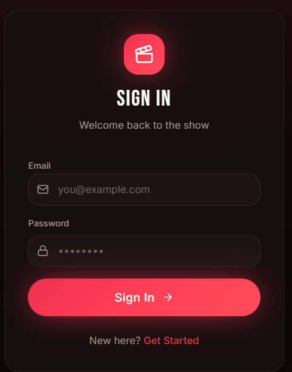
      <br/><b>Sign In</b>
      <br/><sub>JWT-secured login with email and password</sub>
    </td>
    <td align="center" width="50%">
      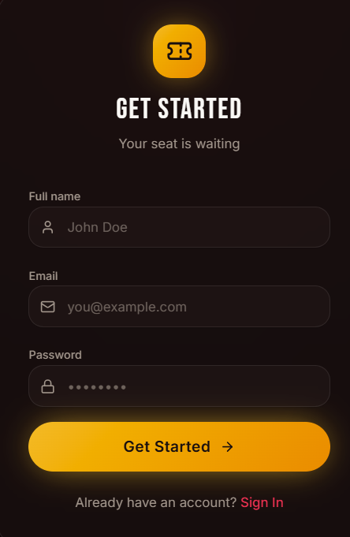
      <br/><b>Sign Up</b>
      <br/><sub>Quick registration to get started with seat reservations</sub>
    </td>
  </tr>
  <tr>
    <td align="center" width="50%">
      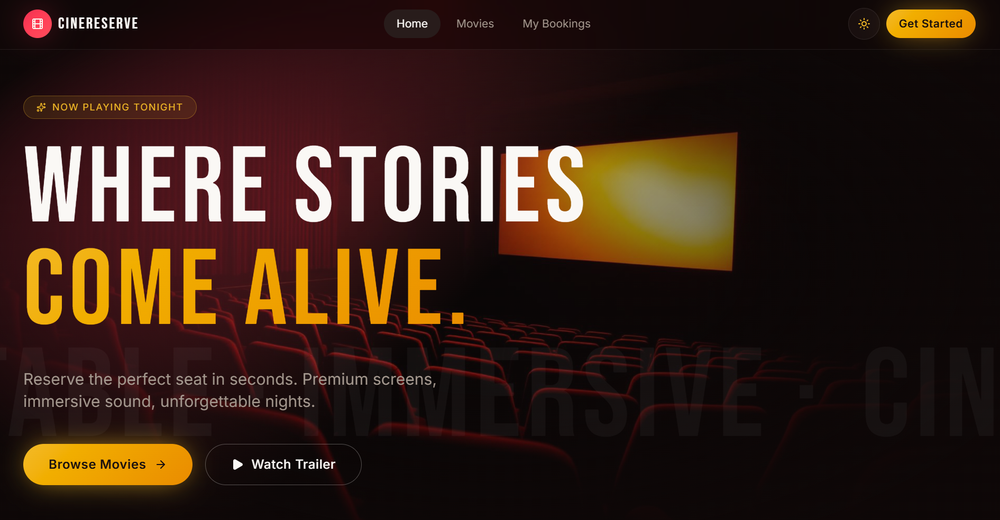
      <br/><b>Home Page</b>
      <br/><sub>Cinematic landing page with hero section and movie highlights</sub>
    </td>
    <td align="center" width="50%">
      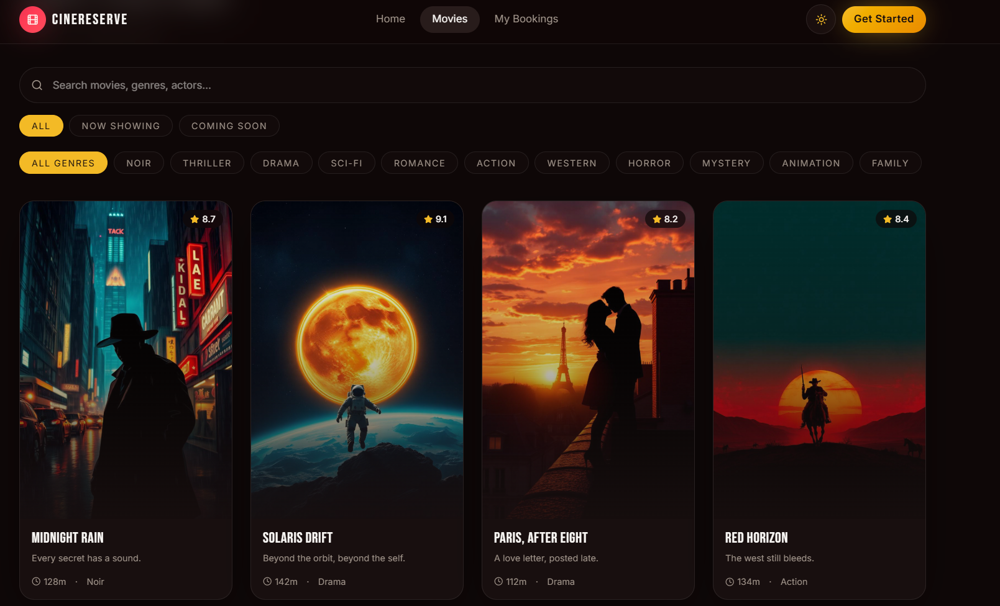
      <br/><b>Movie Catalog</b>
      <br/><sub>Browse movies by genre, status, and search by title or actor</sub>
    </td>
  </tr>
  <tr>
    <td align="center" width="50%">
      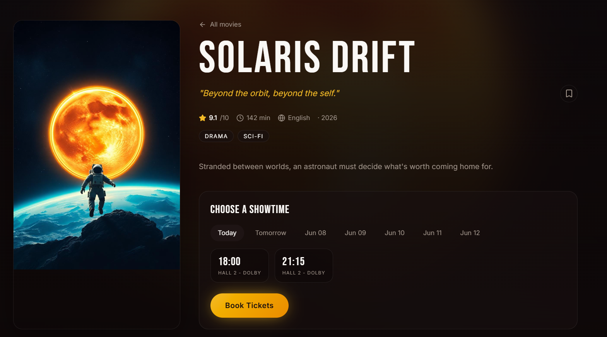
      <br/><b>Movie Details & Showtimes</b>
      <br/><sub>View full movie info, ratings, and select a showtime to book tickets</sub>
    </td>
    <td align="center" width="50%">
      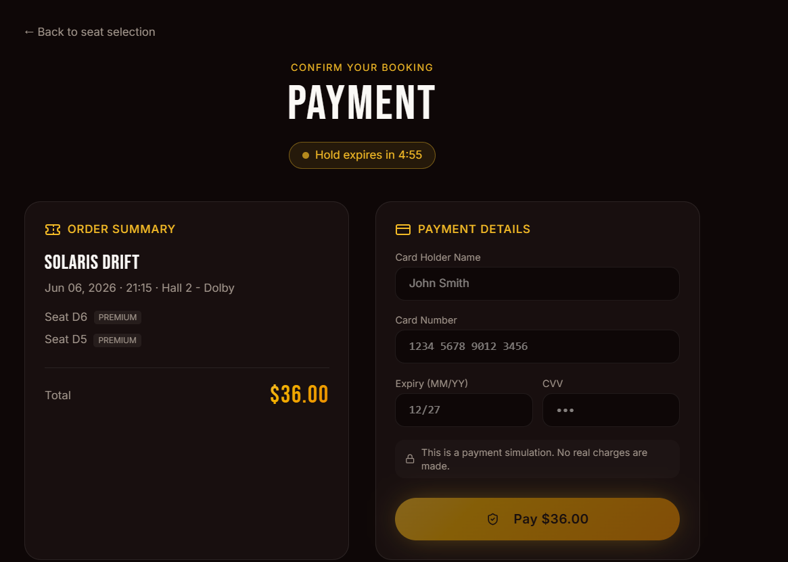
      <br/><b>Payment & Checkout</b>
      <br/><sub>Secure booking confirmation with live seat-hold countdown timer</sub>
    </td>
  </tr>
  <tr>
    <td align="center" width="50%">
      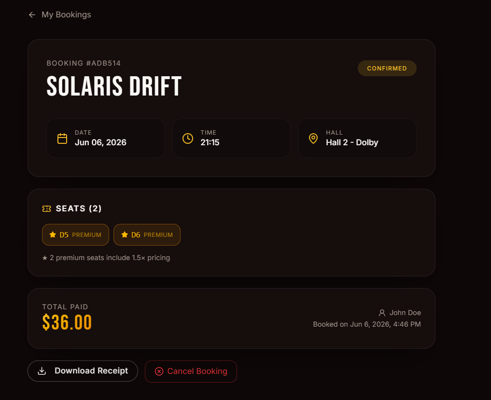
      <br/><b>Booking Details</b>
      <br/><sub>Full reservation breakdown with seat type, hall, and receipt download</sub>
    </td>
    <td align="center" width="50%">
      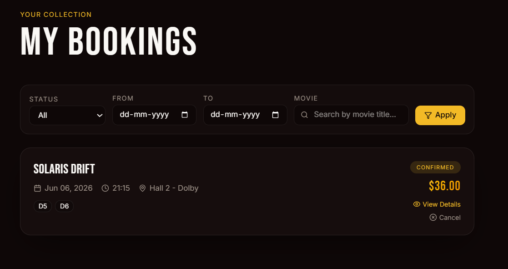
      <br/><b>My Bookings</b>
      <br/><sub>View and filter all past and upcoming reservations with cancel option</sub>
    </td>
  </tr>
  <tr>
    <td align="center" width="50%">
      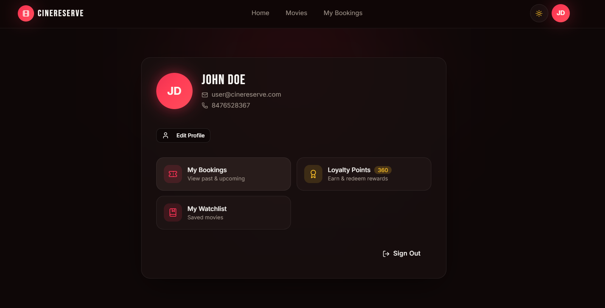
      <br/><b>User Profile</b>
      <br/><sub>Manage profile info, loyalty points balance, watchlist, and sign out</sub>
    </td>
    <td></td>
  </tr>
</table>

### Admin Panel

<table>
  <tr>
    <td align="center" width="50%">
      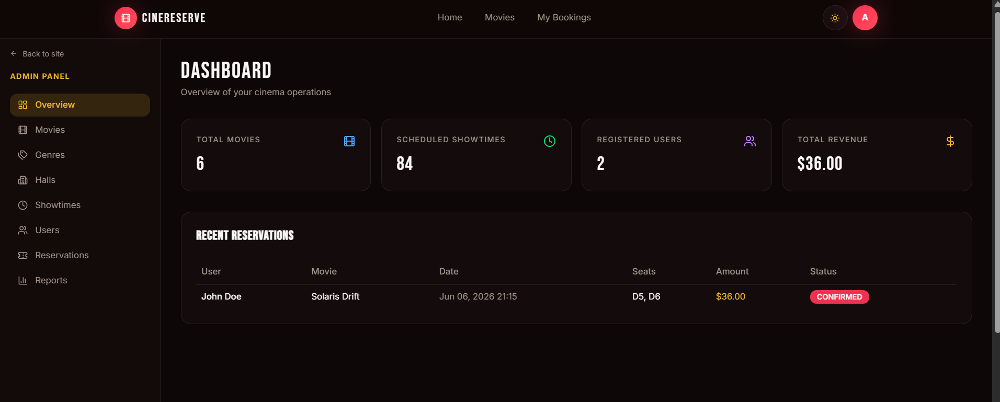
      <br/><b>Admin Dashboard</b>
      <br/><sub>Real-time overview of movies, showtimes, registered users, and total revenue</sub>
    </td>
    <td align="center" width="50%">
      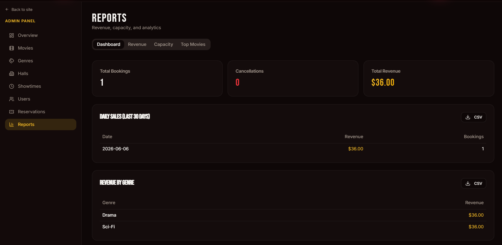
      <br/><b>Reports & Analytics</b>
      <br/><sub>Revenue, daily sales, and genre-based analytics with CSV export</sub>
    </td>
  </tr>
</table>

## 🏗️ System Architecture

```
┌─────────────────────────────────────────────────────────┐
│                  Frontend (React/TanStack)              │
│  - Movie Browsing Interface                             │
│  - Seat Selection UI                                    │
│  - Admin Dashboard                                      │
│  - User Profile Management                              │
└────────────────────────┬────────────────────────────────┘
                         │ REST API
                         │ JWT Authentication
                         ▼
┌─────────────────────────────────────────────────────────┐
│            Backend (Spring Boot 4.0.6)                   │
│  ┌──────────────────────────────────────────────────┐  │
│  │ Controllers (REST Endpoints)                     │  │
│  │  - AuthController                               │  │
│  │  - MovieController                              │  │
│  │  - ShowtimeController                           │  │
│  │  - ReservationController                        │  │
│  │  - SeatHoldController                           │  │
│  │  - ReportController                             │  │
│  │  - UserController                               │  │
│  │  - GenreController                              │  │
│  │  - HallController                               │  │
│  │  - LoyaltyController                            │  │
│  │  - WatchlistController                          │  │
│  └──────────────────────────────────────────────────┘  │
│  ┌──────────────────────────────────────────────────┐  │
│  │ Services (Business Logic)                        │  │
│  │  - AuthService                                  │  │
│  │  - ReservationService (Transaction Management)  │  │
│  │  - SeatHoldService (Hold + Concurrency Control) │  │
│  │  - LoyaltyService (Points Engine)               │  │
│  │  - WatchlistService                             │  │
│  │  - ReportService                                │  │
│  │  - MovieService                                 │  │
│  └──────────────────────────────────────────────────┘  │
│  ┌──────────────────────────────────────────────────┐  │
│  │ Security & Filters                               │  │
│  │  - JwtAuthenticationFilter                      │  │
│  │  - JwtUtil (JWT Token Management)               │  │
│  │  - SecurityConfig (RBAC)                        │  │
│  └──────────────────────────────────────────────────┘  │
└────────────────────────┬────────────────────────────────┘
                         │ JPA/Hibernate ORM
                         ▼
┌─────────────────────────────────────────────────────────┐
│              Database (H2 / PostgreSQL)                  │
│  ┌──────────────────────────────────────────────────┐  │
│  │ Tables:                                          │  │
│  │  - users, genres, movies, movie_genre           │  │
│  │  - halls, seats, showtimes                       │  │
│  │  - reservations, reservation_seats              │  │
│  │  - seat_holds, seat_allocations                  │  │
│  │  - loyalty_transactions, watchlist              │  │
│  └──────────────────────────────────────────────────┘  │
└─────────────────────────────────────────────────────────┘
```

## 🗄️ Database Schema

### Core Entities

**User**
- id (UUID), name, email, password_hash, role (USER/ADMIN), phone, address, loyalty_points, timestamps

**Movie**
- id, title, description, posterUrl, durationMinutes, rating, year, genres (M:N)

**Genre**
- id, name

**Hall (Theater)**
- id, name, totalRows, seatsPerRow

**Seat**
- id, hall_id, row_label, seat_number, seat_type (REGULAR/PREMIUM)

**Showtime**
- id, movie_id, hall_id, start_time, end_time, price, status (SCHEDULED/CANCELLED)

**Reservation**
- id (UUID), user_id, showtime_id, status (CONFIRMED/CANCELLED), total_amount, timestamps

**ReservationSeat** (Junction Table)
- id, reservation_id, seat_id, showtime_id

**SeatHold**
- id (UUID), user_id, showtime_id, seat_ids (JSON), status (ACTIVE/CONFIRMED/EXPIRED/RELEASED), expires_at

**SeatAllocation** (Concurrency Lock)
- id, showtime_id, seat_id — `UNIQUE(showtime_id, seat_id)` enforces one-hold-per-seat

**LoyaltyTransaction**
- id, user_id, type (EARNED/REDEEMED), points, description, reservation_id, created_at

**Watchlist**
- id, user_id, movie_id — `UNIQUE(user_id, movie_id)`

### Key Constraints
- ✅ `UNIQUE(showtime_id, seat_id)` on `seat_allocations` — DB-enforced concurrency guard
- ✅ `UNIQUE(user_id, movie_id)` on `watchlist`
- ✅ No overlapping showtimes on the same hall
- ✅ Soft delete for movies with active reservations

## 🚀 Quick Start

### Frontend Setup
```bash
cd Frontend
npm install
npm run dev              # Run dev server on http://localhost:5173
npm run build            # Production build
```

### Backend Setup
```bash
cd MovieReservationSystem
mvn clean install        # Install dependencies
mvn spring-boot:run      # Run on http://localhost:8080

# Or run using IDE
# The application will create and seed the H2 database automatically
```

### Default Admin Credentials
```
Email: admin@cinereserve.com
Password: Admin@123
```

### Accessing Services
- **Frontend**: http://localhost:5173
- **Backend API**: http://localhost:8080
- **Swagger UI**: http://localhost:8080/swagger-ui.html
- **H2 Console**: http://localhost:8080/h2-console

## 📚 Complete API Documentation

### Authentication Endpoints
| Method | Endpoint | Description |
|--------|----------|-------------|
| POST | `/api/auth/register` | Register new user |
| POST | `/api/auth/login` | Login & receive JWT |

### Movie Endpoints
| Method | Endpoint | Description | Access |
|--------|----------|-------------|--------|
| GET | `/api/movies` | List movies | Public |
| GET | `/api/movies?genre=ACTION` | Filter by genre | Public |
| GET | `/api/movies/{id}` | Get movie details | Public |
| POST | `/api/movies` | Create movie | Admin |
| PUT | `/api/movies/{id}` | Update movie | Admin |
| DELETE | `/api/movies/{id}` | Delete movie | Admin |

### Showtime Endpoints
| Method | Endpoint | Description | Access |
|--------|----------|-------------|--------|
| GET | `/api/movies/{id}/showtimes?date=YYYY-MM-DD` | List showtimes | Public |
| GET | `/api/showtimes/{id}/seats` | View available seats | User |
| POST | `/api/showtimes` | Create showtime | Admin |
| PUT | `/api/showtimes/{id}` | Update showtime | Admin |
| DELETE | `/api/showtimes/{id}` | Cancel showtime | Admin |

### Reservation Endpoints
| Method | Endpoint | Description | Access |
|--------|----------|-------------|--------|
| POST | `/api/reservations` | Create reservation | User |
| GET | `/api/reservations/me?status=&from=&to=&movie=` | View my reservations (filtered) | User |
| DELETE | `/api/reservations/{id}` | Cancel reservation | User |
| GET | `/api/reservations` | View all (admin) | Admin |

### Seat Hold Endpoints
| Method | Endpoint | Description | Access |
|--------|----------|-------------|--------|
| POST | `/api/holds` | Create seat hold (5-min TTL) | User |
| GET | `/api/holds/{holdId}` | Get hold status | User |
| DELETE | `/api/holds/{holdId}` | Release hold | User |
| POST | `/api/holds/{holdId}/refresh` | Extend TTL | User |
| POST | `/api/holds/{holdId}/confirm` | Confirm → Reservation | User |

### User Profile & Loyalty Endpoints
| Method | Endpoint | Description | Access |
|--------|----------|-------------|--------|
| GET | `/api/users/me` | Get profile | User |
| PUT | `/api/users/me` | Update profile | User |
| GET | `/api/users/me/loyalty/balance` | Get loyalty points | User |
| GET | `/api/users/me/loyalty/history` | Loyalty transaction log | User |
| POST | `/api/users/me/loyalty/redeem` | Redeem points | User |

### Watchlist Endpoints
| Method | Endpoint | Description | Access |
|--------|----------|-------------|--------|
| GET | `/api/users/me/watchlist` | Get watchlist | User |
| POST | `/api/movies/{id}/watchlist` | Add to watchlist | User |
| DELETE | `/api/movies/{id}/watchlist` | Remove from watchlist | User |
| GET | `/api/movies/{id}/watchlist/status` | Check if bookmarked | User |

### Admin Endpoints
| Method | Endpoint | Description |
|--------|----------|-------------|
| GET | `/api/users` | List all users |
| PATCH | `/api/users/{id}/role` | Update user role |
| GET | `/api/genres` | List genres |
| POST | `/api/genres` | Create genre |
| DELETE | `/api/genres/{id}` | Delete genre |
| GET | `/api/halls` | List halls |
| POST | `/api/halls` | Create hall |
| GET | `/api/reports/revenue?from=&to=` | Revenue report |
| GET | `/api/reports/capacity/{showtimeId}` | Occupancy report |
| GET | `/api/reports/top-movies` | Top-grossing movies |

## 🔒 Security Features

- **JWT Authentication**: Secure token-based authentication
- **Password Hashing**: BCrypt password encryption (cost factor: 12)
- **Role-Based Access Control (RBAC)**: USER and ADMIN roles
- **CORS Configuration**: Properly configured for development
- **SQL Injection Prevention**: Parameterized queries via JPA/Hibernate
- **Request Validation**: Input validation at controller level

## 🎬 Concurrency & Overbooking Prevention

The system implements multi-layered concurrency control to prevent double-booking:

1. **Database Unique Constraint**: `UNIQUE(showtime_id, seat_id)` on ReservationSeat table
2. **Transactional Integrity**: `@Transactional` on booking operations
3. **Seat Lock Verification**: Check seat availability before reservation
4. **Pessimistic Approach**: Validate each seat individually

### Booking Workflow
```
1. Begin Transaction
2. Validate Showtime (exists, scheduled, future)
3. Lock Requested Seats (verification)
4. Check Each Seat (not already booked for this showtime)
5. Calculate Total (with premium multiplier if applicable)
6. Create Reservation
7. Create ReservationSeat entries
8. Commit / Rollback on conflict
```

## 💡 Premium Seat Pricing

Premium seats are charged at **1.5x** the base showtime price:
```
Premium Seat Price = Showtime Price × 1.5
Regular Seat Price = Showtime Price
```

## 📊 Reports & Analytics

### 1. Revenue Report
- Total revenue for date range
- Breakdown by movie
- Filter by date range

### 2. Capacity Report
- Total seats in showtime
- Booked seats count
- Occupancy percentage

### 3. Top-Grossing Movies
- Movies ranked by total revenue
- Top 10 movies

### 4. Reservation Filters
- By user
- By movie
- By date range
- By status (CONFIRMED/CANCELLED)

## 🧪 Testing

### Unit Testing
- Service layer logic tests
- Business rule validation tests

### Integration Testing
- API endpoint testing
- Database transaction tests
- Concurrency tests (parallel bookings)

### Edge Cases Tested
- Booking same seat concurrently
- Cancelling past reservations
- Overlapping showtime prevention
- Non-admin access attempts

## 📦 Tech Stack

### Backend
- **Framework**: Spring Boot 4.0.6
- **Language**: Java 21
- **Database**: H2 (in-memory, for development)
- **ORM**: Spring Data JPA with Hibernate
- **Authentication**: JWT (jjwt 0.12.6)
- **Security**: Spring Security
- **Validation**: Spring Boot Validation
- **Documentation**: SpringDoc OpenAPI (Swagger)
- **Utilities**: Lombok

### Frontend
- **Framework**: React 19.2.0
- **Routing**: TanStack Router (v1.168.25)
- **Styling**: Tailwind CSS 4.2.1
- **UI Components**: Radix UI
- **Forms**: React Hook Form
- **State Management**: TanStack React Query
- **Build Tool**: Vite 7.3.1
- **Type Safety**: TypeScript 5.8.3

### Development Tools
- **Maven**: Build & dependency management
- **Git**: Version control
- **H2 Database Console**: In-memory DB management
- **Swagger UI**: API documentation

## 📁 Project Structure

```
Movie Reservation System/
├── Frontend/                          # React Frontend Application
│   ├── src/
│   │   ├── components/                # Reusable UI components
│   │   ├── routes/                    # Page components & routing
│   │   ├── hooks/                     # Custom React hooks
│   │   ├── lib/                       # API client & utilities
│   │   ├── constants/                 # App constants
│   │   └── assets/                    # Images, styles
│   ├── package.json
│   ├── tsconfig.json
│   └── vite.config.ts
│
├── MovieReservationSystem/            # Spring Boot Backend
│   ├── src/main/java/com/movie_reservation/MovieReservationSystem/
│   │   ├── controller/                # REST Controllers
│   │   ├── service/                   # Business Logic
│   │   ├── entity/                    # JPA Entities
│   │   ├── repository/                # Data Access Layer
│   │   ├── dto/                       # Request/Response DTOs
│   │   ├── exception/                 # Custom Exceptions
│   │   ├── security/                  # JWT & Security
│   │   ├── config/                    # Application Config
│   │   └── MovieReservationSystemApplication.java
│   ├── src/main/resources/
│   │   └── application.properties
│   ├── pom.xml
│   └── mvnw / mvnw.cmd
│
├── docs/                              # Documentation
│   ├── ARCHITECTURE.md                # Detailed system design
│   ├── FRAMEWORKS.md                  # Technology stack details
│   ├── CHANGELOG.md                   # Version history
│   ├── SETUP.md                       # Setup instructions
│   ├── IMPROVEMENTS.md                # Planned improvements
│   ├── ProblemStatement.md            # Original requirements
│   ├── PROJECT_ANALYSIS.md            # Project analysis
│   └── SUMMARY.md                     # Project summary
│
├── Screenshots/                       # Application screenshots
├── AutomationTests/                   # UI automation test suite
├── README.md                          # This file
└── .gitignore
```

## 🔄 Git Workflow

### Initial Setup
```bash
git clone <repository-url>
cd "Movie Reservation System"
```

### Development Workflow
```bash
git checkout -b feature/your-feature
# Make changes
git add .
git commit -m "feat: description of changes"
git push origin feature/your-feature
```

### Commit Message Format
- `feat:` for new features
- `fix:` for bug fixes
- `docs:` for documentation
- `refactor:` for code refactoring
- `test:` for tests
- `chore:` for maintenance

## 📈 Completion Status

### ✅ Completed Features
- [x] User authentication & authorization (JWT + BCrypt-12)
- [x] Role-based access control (ADMIN/USER)
- [x] Movie management (CRUD)
- [x] Genre management
- [x] Hall/Theater management
- [x] Showtime scheduling with overlap prevention
- [x] Seat management & availability
- [x] Multi-seat reservations (atomic transactions)
- [x] Reservation cancellation
- [x] **2-Phase Seat Hold** with 5-min TTL and DB-enforced concurrency control
- [x] **Loyalty Points Engine** (earn 10 pts/$1, redeem, audit log)
- [x] **Watchlist / Movie Favourites**
- [x] **User Profile Management** (name, phone, address)
- [x] **Booking History Filters** (status, date range, movie title)
- [x] Revenue reporting
- [x] Capacity/occupancy reporting
- [x] Top-grossing movies report
- [x] API documentation (Swagger)
- [x] CORS configuration
- [x] Data validation & error handling
- [x] Database seeding with test data
- [x] Frontend UI with React + TanStack Router
- [x] Admin dashboard
- [x] **3-layer automated test suite** (100+ cases — API, unit, integration, UI/BDD)

### 🚀 Optional Extensions
- [ ] Real payment gateway (Stripe/Razorpay)
- [ ] Email notifications
- [ ] OAuth login (Google/Facebook)
- [ ] QR code ticket generation
- [ ] WebSocket real-time seat updates
- [ ] Multi-location support
- [ ] Internationalization (i18n)
- [ ] Containerisation (Dockerfile + docker-compose)

## 🌐 Environment Variables

### Backend (application.properties)
```properties
server.port=8080
spring.datasource.url=jdbc:h2:mem:moviedb
spring.jpa.hibernate.ddl-auto=create-drop
jwt.secret=your-secret-key-here
jwt.expiration=86400000
cors.allowed-origins=http://localhost:5173
```

### Frontend (.env)
```
VITE_API_BASE_URL=http://localhost:8080
```

## 📞 Support & Troubleshooting

### Common Issues

**1. Port Already in Use**
```bash
# Change port in application.properties
server.port=8081
```

**2. CORS Errors**
- Check `cors.allowed-origins` in application.properties
- Verify frontend URL is whitelisted

**3. JWT Token Expired**
- Tokens expire after 24 hours by default
- Login again to get a new token

**4. Database Connection**
- H2 console: http://localhost:8080/h2-console
- Check JDBC URL and credentials

## 📄 License

This project is created for educational purposes as part of a comprehensive backend engineering learning exercise.

## 👤 Author

Anuj Rawat - Full Stack Developer

---

**Last Updated**: June 6, 2026  
**Version**: 1.1.0

